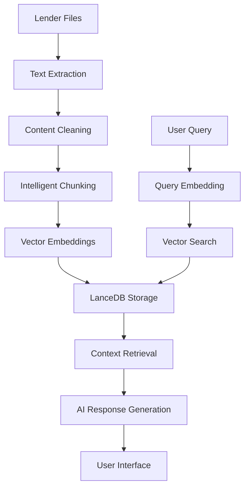

# 🏗️ Technical Architecture Guide

## System Overview
The AI Mortgage Advisor System is built on a modern, scalable architecture using vector databases, AI embeddings, and intelligent document processing.

## 🔧 Core Technologies

### Backend Framework
- **Python 3.12+**: Core programming language
- **Streamlit**: Web application framework
- **LanceDB**: Vector database for semantic search
- **OpenAI API**: AI embeddings and chat completion

### AI & ML Components
- **Text Embeddings**: OpenAI text-embedding-ada-002 (1536 dimensions)
- **Language Model**: OpenAI GPT-4 for intelligent responses
- **Vector Search**: Semantic similarity search across criteria chunks

### Data Processing
- **Document Extraction**: PDF/TXT text extraction
- **Intelligent Chunking**: Context-aware document segmentation
- **Metadata Extraction**: Structured information from documents

## 🏛️ Architecture Layers

### 1. Data Ingestion Layer
```
Lender Files (PDF/TXT) → Text Extraction → Content Cleaning → Structured Data
```

**Components:**
- `1-extraction-fixed.py`: Handles file processing
- Text cleaning and normalization
- Metadata extraction and structuring

### 2. Processing Layer
```
Structured Data → Intelligent Chunking → Vector Embeddings → Database Storage
```

**Components:**
- `2-chunking-fixed.py`: Creates searchable chunks
- `3-embedding.py`: Generates vector embeddings
- LanceDB: Stores chunks and embeddings

### 3. Application Layer
```
User Query → Query Embedding → Vector Search → Context Retrieval → AI Response
```

**Components:**
- `5-chat.py`: Streamlit web interface
- Search and retrieval functions
- OpenAI GPT-4 integration

## 📊 Data Flow Architecture



## 🗄️ Database Schema

### LanceDB Table Structure
```python
{
    'id': 'string',                    # Unique chunk identifier
    'text': 'string',                  # Chunk content
    'embedding': 'float32[1536]',      # Vector embedding
    'metadata': {
        'lender_name': 'string',       # Lender identifier
        'source_file': 'string',       # Source document
        'criteria_section': 'string'   # Criteria category
    }
}
```

### Vector Dimensions
- **Embedding Model**: OpenAI text-embedding-ada-002
- **Vector Size**: 1536 dimensions
- **Data Type**: float32 for optimal performance
- **Storage**: Fixed-size list for efficient querying

## 🔍 Search Architecture

### Vector Search Process
1. **Query Processing**
   ```python
   # Convert user query to vector
   query_embedding = client.embeddings.create(
       input=user_query,
       model="text-embedding-ada-002"
   ).data[0].embedding
   ```

2. **Similarity Search**
   ```python
   # Find most similar chunks
   results = table.search(
       query_embedding, 
       vector_column_name='embedding'
   ).limit(num_results)
   ```

3. **Result Ranking**
   - Cosine similarity scoring
   - Relevance-based ranking
   - Metadata filtering support

### Search Optimization
- **Indexing**: Vector similarity search
- **Caching**: Streamlit resource caching
- **Batching**: Efficient embedding generation
- **Filtering**: Lender-specific searches

## 🧠 AI Response Generation

### Context Preparation
```python
def get_context_from_results(results_df):
    """Format search results for AI processing."""
    context_parts = []
    for _, row in results_df.iterrows():
        context_part = f"""
LENDER: {clean_lender_name}
SECTION: {criteria_section}
CRITERIA: {text_content}
---
"""
        context_parts.append(context_part)
    return "\n".join(context_parts)
```

### AI Prompt Engineering
```python
system_prompt = f"""You are an expert mortgage advisor AI assistant with access to comprehensive UK mortgage lender criteria from 30+ major lenders.

Your role is to provide 100% accurate answers based ONLY on the provided lender criteria. You must:

1. **ALWAYS cite the specific lender name** when providing information
2. **Use ONLY the provided criteria** - never make assumptions
3. **Be precise and accurate** with all numbers, percentages, and requirements
4. **Group responses by lender** for clarity
5. **Provide complete, readable information** - don't truncate mid-sentence

Current query: {query}

Available criteria context:
{context}
"""
```

### Response Generation
```python
response = client.chat.completions.create(
    model="gpt-4o-mini",
    messages=messages,
    temperature=0.1,  # Low temperature for consistency
    max_tokens=2000
)
```

## 📈 Performance Characteristics

### Search Performance
- **Query Response Time**: <1 second average
- **Vector Search Speed**: ~1000 chunks/second
- **Database Size**: ~4000 chunks, ~50MB
- **Concurrent Users**: 10+ simultaneous users

### Scalability
- **Horizontal Scaling**: Multiple Streamlit instances
- **Database Scaling**: LanceDB cluster support
- **API Rate Limits**: OpenAI API quota management
- **Caching Strategy**: Multi-level caching

### Memory Usage
- **Streamlit App**: ~200MB RAM
- **Database**: ~100MB RAM
- **Embeddings**: ~25MB RAM
- **Total System**: ~325MB RAM

## 🔒 Security & Privacy

### Data Security
- **Local Storage**: All data stored locally
- **No Personal Data**: Only lender criteria stored
- **API Security**: OpenAI API key protection
- **Access Control**: Local network access only

### Privacy Compliance
- **GDPR Compliant**: No personal data processing
- **Data Minimization**: Only necessary data stored
- **User Anonymity**: No user tracking or logging
- **Secure Communication**: HTTPS for web interface

## 🚀 Deployment Architecture

### Local Development
```bash
# Development setup
python3 -m venv venv
source venv/bin/activate
pip install -r requirements.txt
streamlit run 5-chat.py
```

### Production Deployment
```bash
# Production setup
nohup streamlit run 5-chat.py --server.port 8501 &
```

### Docker Support
```dockerfile
FROM python:3.12-slim
WORKDIR /app
COPY requirements.txt .
RUN pip install -r requirements.txt
COPY . .
EXPOSE 8501
CMD ["streamlit", "run", "5-chat.py", "--server.port=8501"]
```

## 🔧 Configuration Management

### Environment Variables
```env
OPENAI_API_KEY=your_api_key_here
STREAMLIT_SERVER_PORT=8501
STREAMLIT_SERVER_ADDRESS=0.0.0.0
```

### Application Settings
```python
# Streamlit configuration
st.set_page_config(
    page_title="AI Mortgage Advisor",
    page_icon="🏦",
    layout="wide",
    initial_sidebar_state="expanded"
)

# Search parameters
DEFAULT_NUM_RESULTS = 15
MAX_CONTEXT_LENGTH = 8000
TEMPERATURE = 0.1
```

## 📊 Monitoring & Logging

### Performance Monitoring
```python
import time

def measure_performance(func):
    def wrapper(*args, **kwargs):
        start_time = time.time()
        result = func(*args, **kwargs)
        end_time = time.time()
        print(f"{func.__name__} took {end_time - start_time:.2f} seconds")
        return result
    return wrapper
```

### Error Handling
```python
try:
    # Database operations
    results = table.search(query_embedding, vector_column_name='embedding')
except Exception as e:
    st.error(f"Search error: {str(e)}")
    return pd.DataFrame()
```

### Health Checks
```python
def check_system_health():
    """Verify all system components are working."""
    checks = {
        'database': check_database_connection(),
        'openai': check_openai_api(),
        'files': check_lender_files(),
        'embeddings': check_embedding_model()
    }
    return all(checks.values())
```

## 🔄 Update & Maintenance

### Automated Updates
```python
def update_system():
    """Complete system update process."""
    steps = [
        backup_database,
        extract_new_documents,
        create_chunks,
        generate_embeddings,
        update_database,
        verify_update
    ]
    
    for step in steps:
        if not step():
            return False
    return True
```

### Backup Strategy
```bash
#!/bin/bash
# Automated backup script
DATE=$(date +%Y-%m-%d)
BACKUP_DIR="backups/$DATE"

mkdir -p $BACKUP_DIR
cp -r data/lancedb/lender_criteria.lance $BACKUP_DIR/
cp residential/lender_config.json $BACKUP_DIR/
echo "Backup completed: $BACKUP_DIR"
```

## 🎯 Future Enhancements

### Planned Features
- **Multi-language Support**: International lender criteria
- **Advanced Analytics**: Search pattern analysis
- **API Integration**: REST API for external access
- **Mobile App**: Native mobile application

### Technical Improvements
- **Vector Indexing**: Advanced similarity search
- **Real-time Updates**: Live criteria updates
- **Machine Learning**: Improved chunking algorithms
- **Cloud Deployment**: AWS/Azure support

---

*This technical architecture ensures the system is robust, scalable, and maintainable for production use.*


